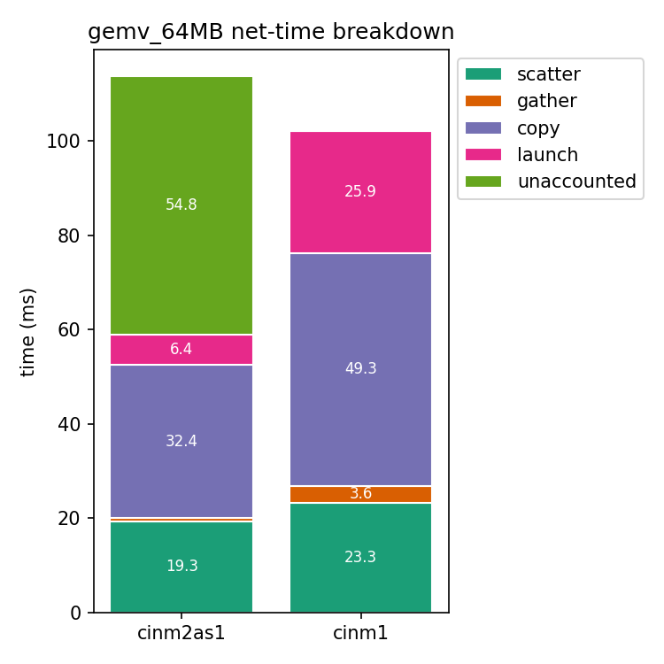
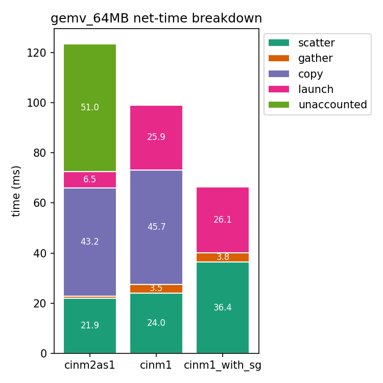

I started this experiment after I realized that the gemv code generated by CINM 2.0 (i.e., my tiled template) was super bad (5 to 10 times worse latency) compared to the code gen of CINM 1.0.

So in this experiment I compare a fixed configuration of CINM 2 that corresponds exactly to the code generated by CINM 1 for the same DPU and tasklet count. The goal is to see what and where the overhead is. My initial assumption when running the wider comparison benchmarks between cinm1 and cinm2 was that cinm2 should be better thanks to better optimizations and codegen templates. But that was wrong.

The initial steps were:
- Fixing the scattering of CINM 1: it was wrong because it didn't check that the scattered blocks were contiguous. By creating an intermediate buffer, which CINM 2 already did correctly, we brought both closer
- Fixing the DPU kernel codegen for CINM2: the on-DPU transfers were improperly batched, there were extra barriers
- Optimizing the upmemrt memrefCopy implementation. It used to copy byte-by-byte, now it copies full blocks. This is huge. I also added timing code to this because why not - it was missing.

After these steps I ended up here:

The main things we can see here is that we have improved significantly the quality of the kernel code, mostly by batching transfers. The gather and scatter are also reduced, mostly because we avoid gathering and scattering again the partial results - they stay where they are. The copy overhead I'm not sure why it's that much lower tbh. 

Here we can see that there is a huge portion of unaccounted time in CINM1. This is due to a partial reduction which should not be there, and (I think) some buffer copies that were done with affine loops (so no time tracking there).

A big chunk of the time is also taken by memrefCopy, equivalent in both cases. But most memref copies are just copying tiles into a compact buffer as input for the scatters. If we can change how we use the UPMEM API to avoid these copies, we may claim a big improvement.  

The unaccounted time I'm still not sure what it is but I think it's about the partial result reduction on the host that doesn't need to be there, and maybe the zero-initialization of some buffers which was done with loops instead of memcpying a constant memref.

---

Then I implemented the scatter/gather thing using UPMEM's API.
At this point it was only implemented in the CINM 1 pipeline so this is the plot to show for it:

